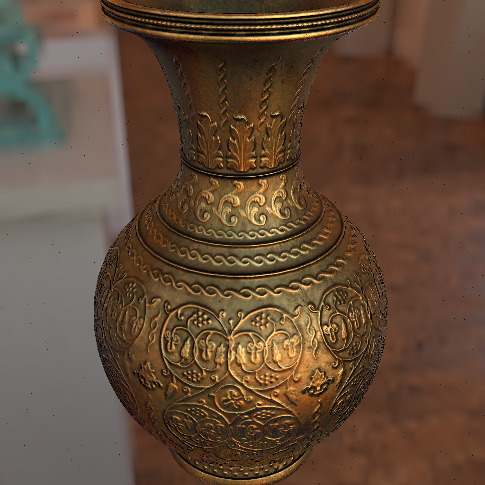

# Spherical Harmonics Rendering (Mitsuba3)

This project is a python implementation of **Spherical Harmonics Rendering** using **Mitsuba3**, which directly project the complicated brdf/bsdf values into to spherical harmonics instead of the simple lighting models such as phong model.

Except for SH Rendering, this project also implements the simplest **Ray-Tracing** pipeline (direct illumination) leveraging mitsuba3 api for us to easily understand the ray-tracing procedures. 

Also, there is a function named **render_ray** in the utils.py which implements the complete ray-tracing procedures presented in the format of a single python function.

Note that all the functions in this project are realized using mitsuba3, which implements the important and basic modules such as ray-scene intersect and bsdf sampling.

## Instructions

First, install the required packages:

```
pip install -r requirements.txt
```

To run a spherical harmonics rendering result (take the scene "jar" for example):

```
python inference.py jar sh
```

To run a mannually ray-tracing rendering result (take the scene "jar" for example):

```
python inference.py jar random
```

Note that within the function "render_mode" of inference.py, there are some parameters for you to balance the efficiency and rendering quality:

```python
batch_spp = 5			# the spps computed at one time. the larger, the faster for rendeing
light_samples = 5000	# the samples for the environment map. more for better light sh coefficients
bsdf_samples = 1000		# the samples for bsdf. more for better transfer coefficients
l_band = 4				# sh band
```

## Rendering Comparison

### scene: brass

Up:  (100 spp) mannual ray-tracing 

Down: (5000 bsdf samples, 5000 light samples) spherical harmonics rendering

Comparison: the SH lighting result is very close to the ray-tracing result, since the object is mostly diffuse

<center class="half">
    
    
</center>


### scene: jar

Up:  (100 spp) mannual ray-tracing 

Down: (5000 bsdf samples, 5000 light samples) spherical harmonics rendering

Comparison: the SH lighting result **lacks highlight** in the left part of rendering, since spherical harmonics is limited to low frequency lighting (you can try increase the number of band for better SH rendering result)

<center class="half">
    
    
</center>


### scene: kitchen

Up:  (100 spp) mannual ray-tracing 

Down: (1000 bsdf samples, 5000 light samples) spherical harmonics rendering

Comparison: the SH lighting result is very close to the direct path traced result, since there are not so much high frequency effects to represent

<center class="half">
    
    
</center>

## Limitations

- This project currently only supports direct SH lighting, since it is computed in pixel space, but not vertex space. So, the second /third bounce SH coefficents will be of high computation.
- Spherical harmonics are limited to low-frequency lighting, which may not be suitable to render glossy objects.

## Thanks to 

Special thanks to these open-sourced repositories, I learnt a lot from them:

- mitsuba3: https://github.com/mitsuba-renderer/mitsuba3
- neural-radiosity-tutorial-mitsuba3: https://github.com/krafton-ai/neural-radiosity-tutorial-mitsuba3
- sphericalharmonics: https://github.com/chalmersgit/SphericalHarmonics